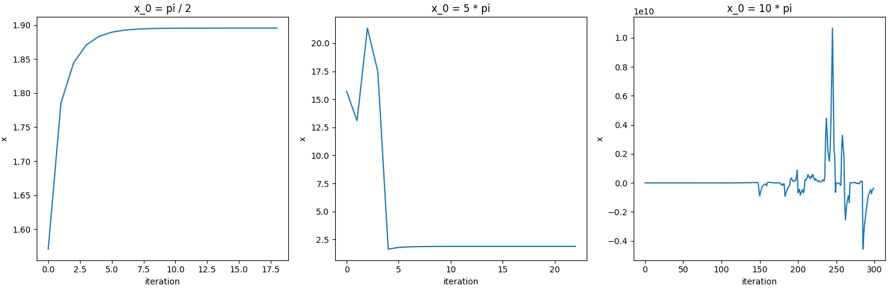
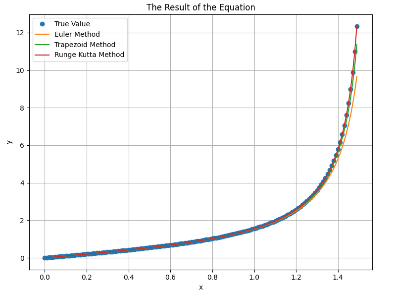

# 数值计算实验报告

梁云森 202222130196 2022 级计算机取向 

---

### 第一章 误差理论

#### Test 1

- **实验要求**：

  求解方程 $x^{2} + (\alpha + \beta)x + 10^{9} = 0$ 的根，其中 $\alpha = -10^{9},\beta = -1$。

- **实验过程**：
  
  观察到原方程为一元二次方程，故可以使用求根公式得到：
  $$
  x =  \frac{-(\alpha+\beta)\pm\sqrt{(\alpha+\beta)^{2}-4\times10^{9}}}{2}
  $$
  我们可以注意到，$\alpha$ 和 $\beta$ 之间的阶数差距过大，可能需要对于式子进行格式的变化。、

  但是此时直接将 $\alpha$ 和 $\beta$ 的数值代入即可，因为计算机浮点数存储遵循 IEEE754 标准，32 位机器的尾数域有 23 位已经足够精确，或者可以使用 4 位截断法也可以得到结果。
  
  如果我们想在形式上获取更优的答案，考虑对于：
  $$
  x_2 = \frac{-b-\sqrt{b^2-4ac}}{2a}
  $$
  因为 $b^{2}$ 远大于 $4ac$，所以 $\sqrt{b^{2} - 4ac} \approx|b|$，所以在计算 $-b - \sqrt{b^{2} - 4ac}$ 的时候会产生较大的误差。
  
  为了解决这一个问题，可以对于 $x_2$ 的形式进行分母有理化变换，变为：
  $$
  x_2 = \frac{2c}{-b + \sqrt{b^{2} - 4ac}}
  $$
  
- **实验结果**：

  ```
  x1 =  1000000000.0
  x2 =  1.0
  ```
  
- **实验代码：**

  ```python
  import math
  
  alpha = -1e9
  beta = -1
  
  a = 1
  b = alpha + beta
  c = 1e9
  delta = b * b - 4 * a * c
  x1 = (-b + math.sqrt(delta)) / (2 * a)
  x2 = 2 * c / (-b + math.sqrt(delta))
  
  print(x1)
  print(x2)
  ```

#### Test 2

- **实验要求**：

  以计算 $x^{31}$ 为例，讨论如何设计计算格式才能减少计算次数。

- **实验过程**：

  可以采用快速幂算法。即需要计算 $x^{n}$ 的时候，可以先计算 $x^{n / 2}$，以此类推。
  
  故原问题可以写为：
  $$
  x^{31} = x \times (x^{15})^{2}, \quad x^{15} = x \times (x^{7})^{2}, \quad x^{7} = x \times (x^{3})^{2}, \quad x^{3} = x \times (x)^{2}
  $$

这样，我们在计算 $x^{n}$ 的时候，仅需要 $O(\log(n))$ 次乘法运算。

- **实验结果**：

  ```
  Input: 2
  Output: 2147483648
  ```
  
- **实验代码：**

  ```python
  def quick_power(x):
      y = 31
      ans = 1
      while (y):
          if (y & 1 == 1):
              ans *= x
          x *= x
          y >>= 1
      return ans
  
  x = int(input("Enter a number: "))
  print(quick_power(x))
  ```

### 第二章 非线性方程求根

#### Test 1

- **实验要求**：

  计算方程 $2x^{2} + x -15 = 0$ 的正根($x^{*} = 2.5$)近似值，分别利用下面三种格式编程

  1. $x_{k+1}=15-2x_k^2,k=0,1,2,\cdots $
  2. $x_{k+1}=\frac{15}{2x_{k}+1},k=0,1,2,\cdots$
  3. $x_{k+1}=x_{k}-\frac{2x_{k}^{2}+x_{k}-15}{4x_{k}+1},k=0,1,2,\cdots$

  三种格式都取 $x_0 = 2$。
  依次计算 $x_1, x_2, ..., x_k, ...$，并作图观察解的稳定性、收敛性，并分析其原因。

- **实验过程**：

  使用 `python` 模拟迭代过程，调用 `python` 中的 `matplotlib` 库进行绘图。

- **实验结果**：
  以迭代次数为横坐标，当前迭代次数时的 $x$ 的值为纵坐标，$x1, x2, x3$ 分别代表三种不同迭代方式获得的 $x$ 值，画图得：

  
  如果以 $\frac{|x_{k + 1} - x_k|}{|x_{k + 1}|}< 10^{-6}$ 为停机条件，第二种方式迭代了 78 次，第三种方式仅迭代了 5 次，第一种方式则不收敛。

  可见，实践中，第三种迭代方式收敛要比第二种迭代方式更快。

  由于第一种迭代方式数值过大的影响，再单独画出第二种迭代和第三种迭代的图像。

  

  观察图片，可以直观地看出来，第三种迭代方式相比第二种过程更加平稳，波动比较小，变化相对更加平滑。
  
  - 对于第一种迭代方式，有 $g(x) = 15-2x^{2}$ 并且 $g'(x) = 4x$。此时导数是恒大于 1 的，虽然单纯通过导数我们无法肯定对于选择这一种 $g$ 进行不动点迭代一定会失败，但是没有任何理由期望这一种方法收敛，当然，事实也是这一种方式发散地很快。
  
  - 对于第二种迭代方式，变换迭代形式，可以得到：
    $$
    \lim\limits_{k \to \infty}\frac{x_{k + 1} - x^{*}}{x_k - x^{*}} 	=\lim\limits_{k \to \infty} -\frac{2x^{*}}{2x_k + 1} = -\frac{5}{6}
    $$
    是一个常数，所以第二种迭代方式的收敛速度是线性的。

  - 对于第三种迭代方式，我们可以写为 $g(x) = x - \phi(x)f(x)$ 的形式，其中 $\phi(x) = \frac{15}{2x + 1}$，并且有 $g'(x^{*}) = 0$，所以第三种方式是二次收敛的，相比第二种迭代方式更快。
  
- **实验代码：**

  ```python
  import matplotlib.pyplot as plt
  import sys
  # sys.set_int_max_str_digits(1000000)
  
  def calculate_x1(x):
      k = 0
      timer = 0
      while True:
          x_k = x[k]
          # print(timer)
          cur = 15 - 2 * x_k ** 2
          x.append(cur)
          print(cur)
          if (abs((cur - x_k) / cur) < 1e-6) or (timer > 3):
              break
          timer += 1
          k += 1
  
  def calculate_x2(x):
      k = 0
      timer = 0
      while True:
          x_k = x[k]
          # print(x_k)
          cur = 15 / (2 * x_k + 1)
          x.append(cur)
          if (abs((cur - x_k) / cur) < 1e-6) or (timer > 10000):
          # if timer > 10000:
              print((x[-1] - 2.5) / (x[-2] - 2.5))
              break
          k += 1
          timer += 1
  
  def calculate_x3(x):
      k = 0
      timer = 0
      while True:
          x_k = x[k]
          cur = x_k - (2 * x_k ** 2 + x_k - 15) / (4 * x_k + 1)
          x.append(cur)
          if (abs(cur - x_k) < 1e-6) or (timer > 10000):
          # if timer > 10000:
              break
          k += 1
          timer += 1
  
  x1 = [2]
  x2 = [2]
  x3 = [2]
  
  # calculate_x1(x1)
  calculate_x2(x2)
  # calculate_x3(x3)
  
  # print(len(x1))
  # print(len(x2))
  # print(len(x3))
  
  # time = 100
  # time_x1 = min(len(x1), 3)  
  # time_x2 = min(len(x2), 20) 
  # time_x3 = min(len(x3), 20) 
  
  # print(x1)
  
  # plt.plot([0, 1, 1.5], [2, 7, -38], label="x1")
  # plt.plot(range(time_x2), x2[:time_x2], label="x2")
  # plt.plot(range(time_x3), x3[:time_x3], label="x3")
  # plt.legend()
  
  # plt.axhline(y=2.5, color='r', linestyle='--', label='y=2.5')
  
  # plt.title("the process of solving the equation x = 15 - 2x^2")
  
  # y_ticks = plt.yticks()[0]
  
  # new_ticks = list(y_ticks) + [2.5]
  # plt.yticks(new_ticks)
  
  # plt.xlabel('iteration')
  # plt.ylabel('x')
  
  # plt.show()
  
  flg, axs = plt.subplots(1, 2, figsize=(10, 10))
  
  # axs[0].plot(range(len(x1)), x1, label="x1")
  # axs[0].set_title('x1')
  # axs[0].set_xlabel('iteration')
  # axs[0].set_ylabel('x')
  axs[0].plot(range(len(x2)), x2, label="x2")
  axs[0].set_title('x2')
  axs[0].set_xlabel('iteration')
  axs[0].set_ylabel('x')
  axs[1].plot(range(len(x3)), x3, label="x3")
  axs[1].set_title('x3')
  axs[1].set_xlabel('iteration')
  axs[1].set_ylabel('x')
  
  plt.tight_layout()
  plt.show()
  ```

#### Test 2

- **实验要求：**

  证明方程 $2 - 3x - \sin(x) = 0$ 在 $(0, 1)$ 内有且只有一个实根，使用二分法求误差不大于 $0.0005$ 的根，及其需要的迭代次数。

- **实验过程：**

  设函数 $f(x) = 2 - 3x - \sin x$，则 $f'(x) = -3 - \cos x < 0$，所以函数 $f$ 是单调减的，又 $f(0) = 2 - 0 - 0 = 2, f(1) = 2 - 3 - \sin 1 < 0$，故方程 $2 - 3x - \sin x = 0$ 在 $(0, 1)$ 有且只有一个实根。

  一般情况下，由于单纯的二分法速度通常会比较慢，我们通常会缩小一下区间。此题而言，可以先使用 $\sin(x)$ 的相关不等式对于方程进行放缩，得到一个解的更小区间，然后使用二分法进行迭代求解根。虽然对此题，大概将区间 $(0, 1)$ 二分 10 次以后，大概就可以得到比较好的结果，缩小区间并不是很必要，但是我认为这是一个应用二分法的一个常见流程或者范式。

  在区间 $(0, 1)$ 中，我们知道 $\frac{2}{\pi} x < \sin x < x$，所以，将 $\frac{2}{\pi}x$ 和 $x$ 分别替换掉 $\sin x$ 并且求解方程可以得到，根的一个小区间是 $[\frac{1}{2}, \frac{2\pi}{2 + 3\pi}]$，然后我们再使用二分法求解即可。

- **实验结果：**

  ```
  root:  0.506444858540914
  iteration:  7
  ```

  此时，$|x - x^{*}| \leq \frac{1}{2^{7} }\times \frac{\pi - 2}{4 + 6\pi} = 0.000390< 0.0005$，满足题目要求。

  如果二分之前不缩小区间，则结果为：

  ```
  root:  0.505126953125
  iteration:  11
  ```

  此时，$|x - x^{*}|< \frac{1}{2^{11}} = 0.000488 < 0.0005$ 满足要求。

  实践证明，缩小区间的范围大概少迭代了 4 次，虽然在此题上作用并不明显，但是一般情况下，事先缩小区间还是能大幅度提高我们的求解速度的。

- **实验代码：**

  ```python
  import math
  
  def sign(x):
      if x > 0:
          return 1
      elif x < 0:
          return -1
      else:
          return 0
  
  def f(x):
      return 2 - 3 * x - math.sin(x)
  
  def bisection(f, a, b, tol):
      cot = 0
      if f(a) == 0:
          return a
      if f(b) == 0:
          return b
      if sign(f(a)) == sign(f(b)):
          print("f(a) and f(b) must have opposite signs")
          return None
      # while abs(b - a) > tol:
      # while ()
      timer = 0
      while timer < 11:
          cot += 1
          c = (a + b) / 2
          if f(c) == 0:
              return c
          if sign(f(c)) == sign(f(a)):
              a = c
          else:
              b = c
          timer += 1
      return (a + b) / 2, cot
  
  a = (2 / (2 / math.pi + 3)) + 0.5
  b = 0.5
  
  # ans, cot = bisection(f, a, b, 1e-6)
  ans, cot = bisection(f, 0, 1, 1e-6)
  print("root: ", ans)
  print("iteration: ", cot)
  ```

#### Test 3

- **实验要求：**

  利用牛顿法求解方程
  $$
  \frac{1}{2} + \frac{1}{4}x^{2} - x\sin x - \frac{1}{2} \cos 2x = 0
  $$
  分别取 $x_0 = \frac{\pi}{2}, 5\pi, 10\pi$，使得精度不超过 $10^{-5}$，比较初值对计算结果的影响。

- **实验过程：**

  设 $f(x) = \frac{1}{2} + \frac{1}{4}x^{2} - x\sin x - \frac{1}{2} \cos 2x$，对于 $f(x)$ 求导，得到：
  $$
  f'(x) = \frac{1}{2}x - \sin x - x \cos x + \sin2x
  $$
  迭代方程为：
  $$
  x_{k + 1} = g(x_k) = x_k - \frac{f(x_k)}{f'(x_k)}
  $$
  设停机条件为 $|x_{k + 1} - x_k| < 10^{-5}$，使用 `python` 模拟迭代过程，使用 `matplotlib` 画图，可以直观比较不同初值对于牛顿法的影响。

- **实验结果：**

  以横坐标作为迭代次数，纵坐标作为每一次下 $x$ 的值，可以画出不同初值下的牛顿法过程：

   

  其中，第一种迭代的结果是：

  ```
  x1:  1.8954935361019158
  iteration: 17
  ```

  第二种迭代的结果是：

  ```
  x2:  1.8954936087748953
  iteration: 21
  ```

  第三种迭代并不收敛，序列发散。

  所以，当初值更加靠近精确解时，达到同样的误差所需要的牛顿迭代次数更少。此外，当初值选择的偏离解太远时会导致迭代不收敛，即得不到解。

- **实验代码：**

  ```python
  import math
  import matplotlib.pyplot as plt
  eps = 1e-6
  
  def f(x):
      return 1 / 2 + 1 / 4 * x **2 - x * math.sin(x) - 1 /2 * math.cos(2 * x)
  
  def f_(x):
      return 0.5 * x - math.sin(x) - x * math.cos(x) + math.sin(2 * x)
  
  def calculate_x(x):
      k = 0
      timer = 0
      while True:
          x_k = x[k]
          cur = x_k - f(x_k) / f_(x_k)
          x.append(cur)
          if (abs(cur - x_k) < eps) or (timer > 10000):
              break
          k += 1
          timer += 1
      return timer
  
  x1 = [math.pi / 2]
  x2 = [5 * math.pi]
  x3 = [10 * math.pi]
  
  cot1 = calculate_x(x1)
  cot2 = calculate_x(x2)
  cot3 = calculate_x(x3)
  
  print("x1: ", x1[-1])
  print("x2: ", x2[-1])
  print("x3: ", x3[-1])
  print("cot1: ", cot1)
  print("cot2: ", cot2)
  print("cot3: ", cot3)
  
  # plt.plot(range(len(x1)), x1, label='x1')
  # plt.plot(range(len(x2)), x2, label='x2')
  # # plt.plot(range(50), x3[:50], label='x3')s
  # plt.xlabel("iteration")
  # plt.ylabel("x")
  # plt.legend()
  # plt.show()
  fig, axs = plt.subplots(1, 3, figsize=(15, 5))
  axs[0].plot(range(len(x1)), x1, label='x1')
  axs[0].set_xlabel("iteration")
  axs[0].set_ylabel("x")
  axs[0].set_title("x_0 = pi / 2")
  axs[1].plot(range(len(x2)), x2, label='x2')
  axs[1].set_xlabel("iteration")
  axs[1].set_ylabel("x")
  axs[1].set_title("x_0 = 5 * pi")
  axs[2].plot(range(len(x3[:300])), x3[:300], label='x3')
  axs[2].set_xlabel("iteration")
  axs[2].set_ylabel("x")
  axs[2].set_title("x_0 = 10 * pi")
  plt.tight_layout()
  plt.show()
  ```

#### Test 4

- **实验要求：**

  已知
  $$
  f(x) = 5x - e^{x}
  $$
  在 $(0, 1)$ 之间有一个实根，试分别利用二分法、牛顿法、割线法、试位法设计相应的计算格式，并编程求解（精确到 4 位小数）。

- **实验过程：**

  首先，可以使用不等式对于原函数进行放缩，得到一个解的存在的小区间。

  在区间 $(0, 1)$ 上，由不等式 $e^{x} \leq (e - 1)x + 1$ 和 $e^{x} >= x + 1$，则解得，解存在的一个小区间是 $(\frac{1}{4}, \frac{1}{6-e})$。在此区间上，我们可以更快地进行二分法、牛顿法、割线法和试位法。

- **实验结果：**

  实验得到，牛顿法、割线法和试位法的迭代次数显著少于二分法。

  即使现在的区间已经很小了，二分法需要的迭代次数仍然比较多，这也体现了这是一种比较慢的方式，但是它比较稳定，所以我们经常用在找出一个近似解以后的后续求解。

  ```
  Bisection:  0.2591642678497009 10
  Newton:  0.25917110121125275 2
  Secant:  0.25917049466126785 2
  Falsi:  0.2591712206948104 1
  ```

- **实验代码：**

  ```python
  import math
  import numpy as np
  
  eps = 1e-4
  
  def f(x):
      return 5 * x - math.exp(x)
  
  def f_(x):
      return 5 - math.exp(x)
  
  def bisection(f, a, b, tol):
      cot = 0
      if f(a) == 0:
          return a
      if f(b) == 0:
          return b
      if f(a) * f(b) > 0:
          print("f(a) and f(b) must have opposite signs")
          return None
      while abs(b - a) > tol:
          cot += 1
          c = (a + b) / 2
          if f(c) == 0:
              return c
          if f(c) * f(a) > 0:
              a = c
          else:
              b = c
      return (a + b) / 2, cot
      
  def Newton(a, b):
      cot = 0
      x = (a + b) / 2
      while True:
          x_k = x
          x = x_k - f(x_k) / f_(x_k)
          cot += 1
          if abs(x - x_k) < eps or cot > 10000:
              break
      return x, cot
  
  def Secant(a, b):
      cot = 0
      x_k = a
      x_k_1 = b
      while True:
          x_k_2 = x_k_1 - f(x_k_1) * (x_k_1 - x_k) / (f(x_k_1) - f(x_k))
          cot += 1
          if abs(x_k_2 - x_k_1) < eps or cot > 10000:
              break
          x_k = x_k_1
          x_k_1 = x_k_2
      return x_k_2, cot
  
  def Falsi(a, b):
      p0 = a
      p1 = b
      pre = 0
      timer = 0
      p = 0
      while True:
          l = f(p0)
          r = f(p1)
          p = p1 - r * (p1 - p0) / (r - l)
          if np.sign(f(p)) * np.sign(f(p0)) < 0:
              pre = p1
              p1 = p
          else:
              pre = p0
              p0 = p
          if abs(pre - p) <= eps or timer >= 10000:
              break
          timer += 1
      return p, timer
  
  a = 1 / 4
  b = 1 / (6 - math.e)
  
  x_0, cot1 = bisection(f, a, b, eps)
  mid = (a + b) / 2
  x_1, cot2 = Newton(a, b)
  x_2, cot3 = Secant(a, b)
  x_3, cot4 = Falsi(a, b)
  
  print("Bisection: ", x_0, cot1)
  print("Newton: ", x_1, cot2)
  print("Secant: ", x_2, cot3)
  print("Falsi: ", x_3, cot4)
  ```

### 第三章 插值

#### Test 1

- **实验要求：**

  基于不同边界条件的样条函数计算公式推导：

  1. 自然边界
  2. 固定边界
  3. 周期边界
  4. 强制第一个子区间和第二个子区间样条多项式的三阶导数相等，倒数第二个子区间和最后一个子区间的三次样条函数的三阶导数相等
  
- **实验过程：**

  

  

  

  

  

  

- **实验结果：**

  求解系数 $c$ 方程组的方程组形式为

  1. 自然边界：$S''(x_0) = S''(x_n)=0$；线性方程组的形式：

     $$
     \begin{bmatrix}1&0&0&0 &\cdots&0 &0 &0\\h_0&2(h_0+h_1)&h_1& 0&\cdots &0& 0&0\\0&h_1&2(h_1+h_2)&h_2&\cdots&0 & 0&0\\\vdots&\vdots&\vdots&\vdots &\ddots&\vdots&\vdots&\vdots\\0&0&0&0&\cdots&h_{n-2}&2(h_{n-2}+h_{n-1})&h_{n-1} \\ 0&0&0&0&\cdots&0&0&1\end{bmatrix}\begin{bmatrix}c_0\\c_1\\c_2\\c_3\\\vdots\\c_{n-1}\\c_n\end{bmatrix}=\begin{bmatrix}0\\\frac{3(y_2-y_1)}{h_1}-\frac{3(y_1-y_0)}{h_0}\\\frac{3(y_3-y_2)}{h_2}-\frac{3(y_2-y_1)}{h_1}\\\frac{3(y_4-y_3)}{h_3}-\frac{3(y_3-y_2)}{h_2}\\\vdots\\\frac{3(y_n-y_{n-1})}{h_{n-1}}-\frac{3(y_{n-1}-y_{n-2})}{h_{n-2}}\\0\end{bmatrix}
     $$

  2. 固定边界：$S'(x_0) = f'(x_0)$并且$S'(x_n) = f'(x_n)$；线性方程组的形式：

     $$
     \left.\left[\begin{array}{cccccc}2h_0&h_0&0&0&\cdots&0&0&0\\h_0&2(h_0+h_1)&h_1&0&\cdots&0&0&0\\0&h_1&2(h_1+h_2)&h_2&\cdots&0&0&0\\\vdots&\vdots&\vdots&\vdots&\ddots&\vdots&\vdots&\vdots\\0&0&0&0&\cdots&h_{n-2}&2(h_{n-2}+h_{n-1})&h_{n-1}\\0&0&0&0&\cdots&0&h_{n-1}&2h_{n-1}\\\end{array}\right.\right]\begin{bmatrix}c_0\\c_1\\c_2\\c_3\\\vdots\\c_{n-1}\\c_n\end{bmatrix}=\begin{bmatrix}\frac{3(y_1-y_0)}{h_0}-3f'(x_0)\\\frac{3(y_2-y_1)}{h_1}-\frac{3(y_1-y_0)}{h_0}\\\frac{3(y_3-y_2)}{h_2}-\frac{3(y_2-y_1)}{h_1}\\\frac{3(y_4-y_3)}{h_3}-\frac{3(y_3-y_2)}{h_2}\\\vdots\\\frac{3(y_n-y_{n-1})}{h_{n-1}}-\frac{3(y_{n-1}-y_{n-2})}{h_{n-2}}\\3f'(x_n)-\frac{3(y_n-y_{n-1})}{h_{n-1}}\end{bmatrix}
     $$

  3. 周期边界：$ S'(x_0^+)=S'(x_n^-),S''(x_0^+)=S''(x_n^-) $；线性方程组的形式：

     $$
     \left.\left[\begin{array}{cccccc}2h_0&h_0&0&0&\cdots&0&h_{n-1}&2h_{n-1}\\h_0&2(h_0+h_1)&h_1&0&\cdots&0&0&0\\0&h_1&2(h_1+h_2)&h_2&\cdots&0&0&0\\\vdots&\vdots&\vdots&\vdots&\ddots&\vdots&\vdots&\vdots\\0&0&0&0&\cdots&h_{n-2}&2(h_{n-2}+h_{n-1})&h_{n-1}\\1&0&0&0&\cdots&0&0&-1\\\end{array}\right.\right]\begin{bmatrix}c_0\\c_1\\c_2\\c_3\\\vdots\\c_{n-1}\\c_n\end{bmatrix}=\begin{bmatrix}\frac{3(y_1-y_0)}{h_0}-\frac{3(y_n-y_{n-1})}{h_0}\\\frac{3(y_2-y_1)}{h_1}-\frac{3(y_1-y_0)}{h_0}\\\frac{3(y_3-y_2)}{h_2}-\frac{3(y_2-y_1)}{h_1}\\\frac{3(y_4-y_3)}{h_3}-\frac{3(y_3-y_2)}{h_2}\\\vdots\\\frac{3(y_n-y_{n-1})}{h_{n-1}}-\frac{3(y_{n-1}-y_{n-2})}{h_{n-2}}\\0\end{bmatrix}
     $$

  4. 强制边界：$S'''(x_0) = S'''(x_1)$并且$S'''(x_{n-1}) = S'''(x_n)$；线性方程组形式：

     $$
     \left.\left[\begin{array}{cccccc}h_1&-h_0-h_1&h_0&0&\cdots&0&0&0\\h_0&2(h_0+h_1)&h_1&0&\cdots&0&0&0\\0&h_1&2(h_1+h_2)&h_2&\cdots&0&0&0\\\vdots&\vdots&\vdots&\vdots&\ddots&\vdots&\vdots&\vdots\\0&0&0&0&\cdots&h_{n-2}&2(h_{n-2}+h_{n-1})&h_{n-1}\\0&0&0&0&\cdots&h_{n-1}&-h_{n-1}-h_{n-2}&h_{n-2}\\\end{array}\right.\right]\begin{bmatrix}c_0\\c_1\\c_2\\c_3\\\vdots\\c_{n-1}\\c_n\end{bmatrix}=\begin{bmatrix}0\\\frac{3(y_2-y_1)}{h_1}-\frac{3(y_1-y_0)}{h_0}\\\frac{3(y_3-y_2)}{h_2}-\frac{3(y_2-y_1)}{h_1}\\\frac{3(y_4-y_3)}{h_3}-\frac{3(y_3-y_2)}{h_2}\\\vdots\\\frac{3(y_n-y_{n-1})}{h_{n-1}}-\frac{3(y_{n-1}-y_{n-2})}{h_{n-2}}\\0\end{bmatrix}
     $$
     求解出系数 $c$ 以后，我们就可以进而得到每一个小区间上的三次函数，就得到了整体的样条函数。

#### Test 2

- **实验要求：**

  以 $y = \sin x $ 为例，在 $[0, \pi]$ 区间内生成 11 个、21 个数据点，设计算法或程序，用上述 4 个边界条件，分别计算其样条插值，并作图比较，分析其差异性。

- **实验过程：**

  没有使用 `python` 中自带的有关三次样条插值的库函数，而是对于不同的边界条件模拟上一个题目中构造出来的方程组。

  同时方程组求解也没有使用库函数，而是模拟 $LU$ 分解求解方程组，得到系数 $c$。通过使用 $c$ 再去求解 $b、d$，最终得到整个区间上的样条函数。

- **实验结果：**

  实验结果如下图

  

  可见，周期边界下在区间的两个端点左右的区域偏离真实函数的距离比较大，在区间的中间区域逼近效果比较好。其余三种插值条件的逼近效果都比较好。

  进一步画出自由边界、固支边界和第四种特殊边界的和真实函数之间的误差图像

  

  可见，虽然三种方式的误差都比较小，但是相比之下，最后一种特殊边界的情况构造的三次样条插值函数和原函数之间的误差整体最大。

  另外两种边界条件的误差相差不大，但是相比还是固定边界的误差更小一些，这也符合我们课上所学和直观理解。

- **实验代码：**

  ```python
  import numpy as np
  import math
  import matplotlib.pyplot as plt
  
  class Cubic_Spline_Interpolator:
      def __init__(self, x, y, boundary_type='natural', fp0=None, fpn=None):
          self.x = x
          self.y = y
          self.h = np.diff(x)
          self.boundary_type = boundary_type
          self.fp0 = fp0
          self.fpn = fpn
          self.C = self.get_Cubic_Spline_C()
          self.A = y
          self.B = np.zeros(len(self.h))
          self.D = np.zeros(len(self.h))
          self.compute_B_D()
  
      def LU_decompose(self, A):
          n = len(A)
          L = np.eye(n)
          U = np.zeros((n, n))
  
          for i in range(n):
              for j in range(i, n):
                  U[i, j] = A[i, j] - sum(L[i, k] * U[k, j] for k in range(i))
              for j in range(i + 1, n):
                  L[j, i] = (A[j, i] - sum(L[j, k] * U[k, i] for k in range(i))) / U[i, i]
          
          return L, U
  
      def forward_substitution(self, L, b):
          n = len(b)
          y = np.zeros(n)
          for i in range(n):
              y[i] = b[i] - sum(L[i, j] * y[j] for j in range(i))
          return y
  
      def backward_substitution(self, U, y):
          n = len(y)
          x = np.zeros(n)
          for i in range(n-1, -1, -1):
              x[i] = (y[i] - sum(U[i, j] * x[j] for j in range(i+1, n))) / U[i, i]
          return x
  
      def solve_equation(self, A, b):
          L, U = self.LU_decompose(A)
          y = self.forward_substitution(L, b)
          x = self.backward_substitution(U, y)
          return x
  
      def get_Cubic_Spline_C(self):
          n = len(self.h)
          A = np.zeros((n + 1, n + 1))
          b = np.zeros(n + 1)
  
          if self.boundary_type == 'natural':  # 自由边界条件
              A[0, 0] = 1
              A[n, n] = 1
          elif self.boundary_type == 'clamped':  # 固定边界条件
              A[0, 0] = 2 * self.h[0]
              A[0, 1] = self.h[0]
              A[n, n] = 2 * self.h[-1]
              A[n, n - 1] = self.h[-1]
              b[0] = 3 * (self.y[1] - self.y[0]) / self.h[0] - 3 * self.fp0
              b[n] = 3 * self.fpn - 3 * (self.y[n] - self.y[n - 1]) / self.h[-1]
          elif self.boundary_type == 'periodic':  # 周期边界条件
              A[0, 0] = self.h[0]
              A[0, 1] = 2 * self.h[0]
              A[0, n] = 2 * self.h[-1]
              A[0, n - 1] = self.h[-1]
              A[n, 0] = 1
              A[n, n] = -1
              b[n] = 0
              b[0] = 3 * (self.y[1] - self.y[0]) / self.h[0] - 3 * (self.y[n] - self.y[n - 1]) / self.h[-1]
          elif self.boundary_type == 'special':
              A[0, 0] = -self.h[1]
              A[0, 1] = self.h[0] + self.h[1]
              A[0, 2] = -self.h[0]
              A[n, n - 2] = -self.h[-1]
              A[n, n - 1] = self.h[-2] + self.h[-1]
              A[n, n] = -self.h[-2]
              b[0] = 0
              b[n] = 0
  
          for i in range(1, n):
              A[i, i] = 2 * (self.h[i - 1] + self.h[i])
              A[i, i - 1] = self.h[i - 1]
              A[i, i + 1] = self.h[i]
  
          for i in range(1, n):
              b[i] = 3 * (self.y[i + 1] - self.y[i]) / self.h[i] - 3 * (self.y[i] - self.y[i - 1]) / self.h[i - 1]
  
          C = self.solve_equation(A, b)
          return C
  
      def compute_B_D(self):
          n = len(self.h)
          for i in range(n):
              self.D[i] = (self.C[i + 1] - self.C[i]) / (3 * self.h[i])
              self.B[i] = (self.A[i + 1] - self.A[i]) / self.h[i] - self.h[i] * (self.C[i + 1] + 2 * self.C[i]) / 3
  
      def __call__(self, x_new):
          y_new = np.zeros_like(x_new)
          for i in range(len(x_new)):
              # index = np.searchsorted(self.x, x_new[i]) - 1
              index = int(x_new[i] // ((b - a) / len(self.h)))
              if index >= len(self.h):
                  index = len(self.h) - 1
              dx = x_new[i] - self.x[index]
              y_new[i] = self.A[index] + self.B[index] * dx + self.C[index] * dx**2 + self.D[index] * dx**3
          return y_new
  
  def f(x):
      return np.sin(x)
  
  if __name__ == '__main__':
      a = 0
      b = math.pi
      num = 11
      x0 = np.linspace(a, b, num)
      y0 = f(x0)
  
      # 自由边界
      cubic_spline_natural = Cubic_Spline_Interpolator(x0, y0, boundary_type='natural')
      x_new = np.linspace(a, b, 100)
      y_new_natural = cubic_spline_natural(x_new)
      y_true = f(x_new)
      plt.plot(x_new, y_new_natural - y_true, label='Cubic Spline Natural')
      # plt.plot(x_new, y_new_natural, label='Cubic Spline Natural')
  
      # 固定边界
      fp0 = math.cos(a)
      fpn = math.cos(b)
      cubic_spline_clamped = Cubic_Spline_Interpolator(x0, y0, boundary_type='clamped', fp0=fp0, fpn=fpn)
      y_new_clamped = cubic_spline_clamped(x_new)
      plt.plot(x_new, y_new_clamped - y_true, label='Cubic Spline Clamped')
      # plt.plot(x_new, y_new_clamped, label='Cubic Spline Clamped')
  
      # 周期边界
      cubic_spline_periodic = Cubic_Spline_Interpolator(x0, y0, boundary_type='periodic')
      y_new_periodic = cubic_spline_periodic(x_new)
      # plt.plot(x_new, y_new_periodic, label='Cubic Spline Periodic')
  
      # 特殊边界
      cubic_spline_special = Cubic_Spline_Interpolator(x0, y0, boundary_type='special')
      y_new_special = cubic_spline_special(x_new)
      # plt.plot(x_new, y_new_special, label='Cubic Spline Special')
      plt.plot(x_new, y_new_special - y_true, label='Cubic Spline Special')
  
      # plt.plot(x_new, y_true, label='ture function')
  
      # plt.scatter(x0, y0, label='Data points', color='red')
      plt.legend()
      # plt.title("Cubic Spline Interpolation with Different Boundary Conditions")
      plt.title("Cubic Spline Interpolation Error with Different Boundary Conditions")
      plt.show()
  ```

#### Test 3

- **实验要求：**

  求一个次数不高于 4 次的多项式，使得：

  - $f(1)=f'(1)=0,f(2)=f'(2)=0,f(3)=1$
  - $f(0)=f'(0)=0,f(1)=f'(1)=1,f(2)=1$

- **实验过程：**

  - 由于 $f(1)=f'(1)=0,f(2)=f'(2)=0$，这几项都是 0，所以只需要考虑 $f(3)$ 对应的多项式，可以设
    $$
    H_3(x) = a(x - x_1)^{2}(x-x_2)^{2}
    $$
    代入 $H_3(3) = 1$，解得 $a = \frac{1}{4}$，所以 $f(x) = \frac{1}{4}(x - 2)^{2}(x-3)^{2}$ 

  - 与问题一同理，我们可以设
    $$
    \begin{aligned}
    H_1(x) &= x^{2}(x - 2)(a_1(x - x_1) + b_1) \\
    \hat{H_1}(x) &= a_2(x-x_0)^{2}(x-x_2)(x-x_1)=a_2x^{2}(x-1)(x-2)\\
    H_2(x) &= a_3(x-x_0)^{2}(x-x_1)^{2}=a_3x^{2}(x-1)^{2}
    \end{aligned}
    $$
    带入求解可以得到：
    $$
    \begin{aligned}
    H_1(x) &= x^2(x-2)^{2} \\
    \hat{H_1}(x) &= -x^{2}(x-1)(x-2)\\
    H_2(x) &= \frac{1}{4} x^{2}(x-1)^{2}
    \end{aligned}
    $$
    所以 $f(x) = x^2(x-2)^{2} -x^{2}(x-1)(x-2)+  \frac{1}{4} x^{2}(x-1)^{2}$

- **实验结果：**

  由上述计算可以得到，两个问题的结果分别是
  $$
  f(x) = \frac{1}{4}(x - 2)^{2}(x-3)^{2} \\
  f(x) = x^2(x-2)^{2} -x^{2}(x-1)(x-2)+  \frac{1}{4} x^{2}(x-1)^{2}
  $$

#### Test 4

- **实验要求：**

  怎样选取步长 $h$，才能使分段线性插值函数和 $\sin x$ 的误差小于 $1.2 \times 10^{-6}$

- **实验过程：**

  我们可以只考虑一段小区间的误差范围，写出一段区间上的线性插值公式：
  $$
  f(x) = P(x) + \frac{f''(\xi(x))}{2}(x - x_0)(x - x_1)
  $$
  其中
  $$
  f(x) = \sin x \\
  P(x) = L_{1,0}f(x_0) + L_{1,1}f(x_1)
  $$
  考虑对于误差项进行变换
  $$
  \begin{aligned}
  |f(x) - P(x)| &= |\frac{-\sin x}{2}(x-x_0)(x-x_0 -h)| \\
  &\leq \frac{1}{2}|(x-x_0)(x-x_0-h)| \\
  &\leq \frac{h^{2}}{8}
  \end{aligned}
  $$
  故 $h \leq \sqrt{9.6 \times 10^{-6}}= 0.00309838$

- **实验结果：**

  取 $h = 0.003$ 编写 `python` 代码进行验证，发现此时在区间 $[0, 2\pi]$ 上插值函数和实际函数的值之间的误差最大达到了 $0.002999995500002025$，这与我们的预期不符。

  分析原因，应该是理论的推导误差确实是此步长符合要求的，但是实际计算中的舍入误差偏大，导致我们的最终误差与理论的期望误差偏差比较大。

- **实验代码：**

  ```python
  import math
  import numpy as np
  import matplotlib.pyplot as plt
  
  def P(x, a, b, h):
      num = x // h
      x0 = a + num * h
      x1 = x0 + h
      Ln0 = (x - x0) / (x1 - x0) * np.sin(x0)
      Ln1 = (x - x1) / (x0 - x1) * np.sin(x1)
      return Ln0 + Ln1
  
  h = 0.001
  a = 0
  b = math.pi * 2
  
  x = np.arange(a, b, h / 3)
  y = np.sin(x)
  y_pred = [P(x[i], a, b, h) for i in range(len(x))]
  
  distance = y - y_pred
  
  Max = np.max(np.abs(distance))
  print(Max)
  ```

#### Test 5

- **实验要求：**

  求满足下列条件的三次样条插值函数 $s(x)$
  $$
  s(1)=s(2)=1, s(3)=2, s'(1)=0, s'(3)=3
  $$

- **实验过程：**

  在区间 $[1, 3]$ 上取三个点 $x_0 = 1, x_1 = 2, x_2 = 3$ 即可。

  同时由于给定了边界两个点的一阶导数，所以是一个固支边界的三次样条插值问题。

  我们求解方程组 $Ax = b$，其中
  $$
  \left.\left[\begin{array}{cccccc}2h_0&h_0&0&0&\cdots&0&0&0\\h_0&2(h_0+h_1)&h_1&0&\cdots&0&0&0\\0&h_1&2(h_1+h_2)&h_2&\cdots&0&0&0\\\vdots&\vdots&\vdots&\vdots&\ddots&\vdots&\vdots&\vdots\\0&0&0&0&\cdots&h_{n-2}&2(h_{n-2}+h_{n-1})&h_{n-1}\\0&0&0&0&\cdots&0&h_{n-1}&2h_{n-1}\\\end{array}\right.\right]\begin{bmatrix}c_0\\c_1\\c_2\\c_3\\\vdots\\c_{n-1}\\c_n\end{bmatrix}=\begin{bmatrix}\frac{3(y_1-y_0)}{h_0}-3f'(x_0)\\\frac{3(y_2-y_1)}{h_1}-\frac{3(y_1-y_0)}{h_0}\\\frac{3(y_3-y_2)}{h_2}-\frac{3(y_2-y_1)}{h_1}\\\frac{3(y_4-y_3)}{h_3}-\frac{3(y_3-y_2)}{h_2}\\\vdots\\\frac{3(y_n-y_{n-1})}{h_{n-1}}-\frac{3(y_{n-1}-y_{n-2})}{h_{n-2}}\\3f'(x_n)-\frac{3(y_n-y_{n-1})}{h_{n-1}}\end{bmatrix}
  $$
  得到系数 $c$，进而可以求解出每一段的三次多项式系数。

- **实验结果：**

  实验绘制的图像如下

  

- **实验代码：**

  ```python
  import numpy as np
  import matplotlib.pyplot as plt
  from scipy.interpolate import CubicSpline
  
  x = np.array([1, 2, 3])
  y = np.array([1, 1, 2])
  
  bc_type = ((1, 0.0), (1, 3.0))
  
  cs = CubicSpline(x, y, bc_type=bc_type)
  
  x_new = np.linspace(1, 3, 100)
  y_new = cs(x_new)
  
  plt.figure(figsize=(8, 6))
  plt.scatter(x, y, marker='o', label='Data points', color='red')
  plt.plot(x_new, y_new, label='Cubic Spline Interpolation')
  plt.axvline(x=1, linestyle='--', color='gray')
  plt.axvline(x=2, linestyle='--', color='gray')
  plt.axvline(x=3, linestyle='--', color='gray')
  plt.legend()
  plt.xlabel('x')
  plt.ylabel('s(x)')
  plt.title('Cubic Spline Interpolation with Specified Conditions')
  plt.grid(True)
  plt.show()
  
  print(f"s'(1) = {cs(1, 1)}")
  print(f"s'(3) = {cs(3, 1)}")
  ```

### 第四章 数值微分与数值积分

#### Test 1

- **实验要求：**推导复合(Composite)梯形公式及其误差估计；推导基于误差控制的逐次半积分梯形公式及其误差估计。

- **实验过程：**

  对于一个区间 $[a, b]$ 上的梯形公式，有
  $$
  \int_a^{b}f(x)\mathrm{d}x = \frac{h}{2}[f(x_0) + f(x_1)] - \frac{h^{3}}{12}f''(\xi)
  $$
  所以对于区间 $[a, b]$，如果将区间划分为 $n$ 个小区间 ，然后每一个区间分别使用梯形公式再求和，则有
  $$
  \begin{aligned}
  \int_a^{b}f(x)\mathrm{d}x &= \sum\limits_{i= 0}^{n - 1}\int_{x_i}^{x_{i + 1}}f(x)\mathrm{d}x \\
  &= \sum\limits_{i = 0}^{n - 1}\frac{h}{2}[f(x_i) + f(x_{i + 1})] - \frac{h^{3}}{12}f''(\xi_i) \\
  &= \frac{h}{2}[f(a) + 2\sum\limits_{i= 1}^{n - 1}f(x_i) + f(b)] - \frac{b - a}{12}h^{2}f''(\mu)
  \end{aligned}
  $$
  对于逐次半积分梯形公式
  $$
  \int_{a}^{b}f\left( x \right)\mathrm{d}x-R_{k,1}=\sum_{i=1}^{\infty}K_{i}h_{k}^{2i}=K_{1}h_{k}^{2}+\sum_{i=2}^{\infty}K_{i}h_{k}^{2i}
  $$
  其中
  $$
  R_{k,j}=R_{k,j-1}+\frac{R_{k,j-1}-R_{k-1,j-1}}{4^{j-1}-1}
  $$
  $R_{k, 1}$ 就是在步长为 $h_k$ 的情况下，复合梯形公式的结果。

- 

#### Test 2

- **实验要求：**

  令 $h = \frac{b - a}{3}, x_0 = a, x_1 = a + h, x_2 = b$，求下面积分公式的精度次数
  $$
  \int_a^{b}f(x)\mathrm{d}x = \frac{9}{4}hf(x_1) + \frac{3}{4}hf(x_2)
  $$

- **实验过程：**
  $$
  \begin{aligned}
  &\text{当}f(x) =1\text{时:}\int_a^bf(x)dx=b-a=\frac94hf(x_1)+\frac34hf(x_2) \\
  &\text{当}f(x) =x\text{时:}\int_a^bf(x)dx=\frac{b^2-a^2}2=\frac94\frac{b-a}3\frac{2a+b}3+\frac34\frac{b-a}3b=\frac94hf(x_1)+\frac34hf(x_2) \\
  &\text{当}f(x) =x^2\text{时:}\int_a^bf(x)dx=\frac{b^3-a^3}3=\frac94\frac{b-a}3(\frac{2a+b}3)^2+\frac34\frac{b-a}3b^2=\frac94hf(x_1)+\frac34hf(x_2 \\
  &\text{当}f(x) =x^{3} 时:\int_a^bf(x)dx=\frac{b^4-a^4}4\neq\frac94\frac{b-a}3(\frac{2a+b}3)^3+\frac34\frac{b-a}3b^3=\frac94hf(x_1)+\frac34hf(x_2)
  \end{aligned}
  $$
  所以这一个积分公式的精度为 2.

#### Test 3

- **实验要求：**

  自行编写复合梯形公式、Simpson 公式的计算程序。

  取 `h = 0.01`，分别利用符合梯形公式、Simpson 公式计算定积分
  $$
  I(f) = \frac{1}{\sqrt{2\pi}} \int_0^{1}\exp^{-\frac{x^{2}}{2}}\mathrm{d}x
  $$
  试与精确解比较，说明两种格式的优劣。

  若取计算精度为 $10^{-4}$，则 $h = ?, n = ?$

- **实验过程：**

  可以推导得到复合梯形公式、Simpson 公式为

  - 复合 Simpson 公式：

    设$f\in C^4[a,b],n$是偶数$,h=(b-a)/n,x_j=a+jh(j=0,1,\cdots,n)$。存在一
    个$\mu\in(a,b)$使得对于$n$个子区间的复合 Simpson 法则及其误差项可以写为
    $$
    \int_{a}^{b}f\left(\:x\:\right)\mathrm{d}x\:=\:\frac{h}{3}\Big[\:f\left(\:a\:\right)+2\:\sum_{j=1}^{(\:n/2\:)-1}f\left(\:x_{2j}\:\right)+4\sum_{j=1}^{n/2}f\left(\:x_{2j-1}\:\right)+f\left(\:b\:\right)\Big]-\frac{b-a}{180}h^{4}f^{(4)}\left(\:\mu\:\right)\:\blacksquare
    $$

  - 复合梯形公式：

    设 $f\in C^2\left[a,b\right],h=(b-a)/n,x_j=a+jh\left(j=0,1,\cdots,n\right)$,则存在一个
    $\mu\in(a,b)$使得对于 $n$ 个子区间的复合梯形法则及其误差项可以写为
    $$
    \int _a^bf(x)dx= \frac h2\left [ f( \:a\:) + 2\sum _{j= 1}^{n- 1}f( \:x_j\:) + f( \:b\:) \right ] - \frac {b- a}{12}h^2f^{\prime \prime }( \mu )
    $$

  后面直接使用 `python` 模拟积分的计算过程即可。

  对于取计算精度为 $10^{-4}$，h 和 n 分别应该取多少。我们可以先尝试分析两种方式积分的误差项。

  对于复合 Simpson 方法，误差项为 $\frac{b-a}{180}h^{4}f^{(4)}\left(\:\mu\:\right)$。通过求导计算可以得到，原函数在区间 $[0, 1]$ 内的四次导的范围为：$[-0.484, 1.197]$。所以，整个误差项的取值范围为 $[\frac{-0.484}{180}h^4, \frac{1.197}{180}h^{4}]$

  为了使得 $\max \frac{b-a}{180}h^{4}f^{(4)}\left(\:\mu\:\right) < 10^{-4}$，求解不等式可以得到 $h$ 的取值范围为
  $$
  h \leq 0.35018
  $$
  值得注意的是，这只是一个充分条件，并不是必要的。

  同样的思路，我们考虑先求解复合梯形法则误差项在要求精度内的充分条件。最终可以得到，此时 $h$ 的取值范围为
  $$
  h \leq 0.05484
  $$
  所以，下面对于复合 Simpson 取 $h=0.25$，对于复合梯形取 $h = 0.05$。此时，可以算出，复合 Simpson 法则要达到 $10^{-4}$ 的精度需要分 $1/0.25 = 4$ 个区间，复合梯形法则需要 $1 / 0.05 = 20$ 个区间。

  当然，这只是充分情况，为了达到 $10^{-4}$ 精度的 $h$ 取值可以比现在的稍大一些。

- **实验结果：**

  ```
  Trapezoid 0.34134272963911727
  Simpson 0.34134474609542964
  ```

  这分别是复合梯形和复合 Simpson 在 $h = 0.01$ 情况下的积分结果。

  由于积分 $I$ 并没有显式的解析解形式，所以无法写出原函数求得精确解。使用专业数学计算器计算得到一个优秀的近似解为

  

  可见，在同样的 $h = 0.01$ 步长下，复合 Simpson 法则要比复合梯形法则更加精确。

  如果要取计算精度为 $10^{-4}$，分别取 $h = 0.25,n=4$ 和 $h = 0.05,n=20$。可以计算出，两种情况下的 Simpson 和梯形的积分结果分别为：

  ```
  h = 0.25
  Trapezoid 0.34008184454556034
  Simpson 0.34135548785664915
  ```

  ```
  h = 0.05
  Trapezoid 0.3413043312993039
  Simpson 0.3413447628870818
  ```

  两者分别符合各自的 $10^{-4}$ 的精度要求。

  由此可见，复合 Simpson 相比复合梯形的计算达到同样精度下，减少的区间划分个数是很显著的。在显著减少区间个数的同时，复合 Simpson 并没有比复合梯形计算量增加很多，所以是一种简单并且优秀的复合积分公式，也是我们生活中经常使用的。

- **实验代码：**

  ```python
  import math
  import numpy as np
  
  true_ans = 0.341344746069
  
  def f(x):
      return math.exp(- x ** 2 / 2)
  
  def Trapezoid(f, a, b, h):
      # x = np.arange(a, b, h)
      n = int((b - a) / h)
      ans = f(a) + f(b)
      for index in range(1, n):
          ans += 2 * f(a + index * h)
      return ans * h / 2
  
  def Simpson(f, a, b, h):
      n = int((b - a) / h)
      ans = f(a) + f(b)
      for index in range(1, n):
          if index % 2 == 0:
              ans += 2 * f(a + index * h)
          else:
              ans += 4 * f(a + index * h)
      return ans * h / 3
  
  a = 0
  b = 1
  # h = 0.01
  # h = 0.25
  h = 0.05
  
  ans1 = 1 / math.sqrt(2 * math.pi) * Trapezoid(f, a, b, h)
  ans2 = 1 / math.sqrt(2 * math.pi) * Simpson(f, a, b, h)
  ans_true = 0.3413447460685
  
  print("Trapezoid", ans1)
  print("Simpson", ans2)
  ```

#### Test 4

- **实验要求：**

  分别利用复合梯形、Simpson 公式计算定积分
  $$
  I(f) = \int_1^{6}(2 + \sin(2\sqrt{x}))\mathrm{d}x
  $$
  取 $h = 0.5, 0.25, 0.125$，列表给出两种格式的近似计算结果。

- **实验过程：**

  由于这一个积分也是没有显式的解析形式的，我们没有办法求解出积分的精确解，通过专业的数学计算器可以得到一个优秀的近似解

  

  然后使用 `python` 分别模拟不同步长下 Simpson 和梯形公式的积分计算。

- **实验结果：**

  结果如下表：

  |           | Trapezoid         | Simpson           |
  | --------- | ----------------- | ----------------- |
  | $h=0.5$   | 8.19385456517253  | 8.183015494056184 |
  | $h=0.25$  | 8.186049263770315 | 8.183447496636239 |
  | $h=0.125$ | 8.184120191790313 | 8.18347716779698  |

  通过表格可以直观看出来，复合 Simpson 积分总是比复合梯形要更加精确一些的，并且单独对于 Simpson 或者梯形其中一者而言，较小的 $h$ 有着更精确的积分结果。

- **实验代码：**

  ```python
  import math
  import pandas as np
  
  def f(x):
      return 2 + math.sin(2 * math.sqrt(x))
  
  def Trapezoid(f, a, b, h):
      # x = np.arange(a, b, h)
      n = int((b - a) / h)
      ans = f(a) + f(b)
      for index in range(1, n):
          ans += 2 * f(a + index * h)
      return ans * h / 2
  
  def Simpson(f, a, b, h):
      n = int((b - a) / h)
      ans = f(a) + f(b)
      for index in range(1, n):
          if index % 2 == 0:
              ans += 2 * f(a + index * h)
          else:
              ans += 4 * f(a + index * h)
      return ans * h / 3
  
  a = 1
  b = 6
  h = [0.5, 0.25, 0.125]
  
  ans_t_1 = Trapezoid(f, a, b, h[0])
  ans_s_1 = Simpson(f, a, b, h[0])
  
  ans_t_2 = Trapezoid(f, a, b, h[1])
  ans_s_2 = Simpson(f, a, b, h[1])
  
  ans_t_3 = Trapezoid(f, a, b, h[2])
  ans_s_3 = Simpson(f, a, b, h[2])
  
  ans_true = 8.1834792076628
  
  print(ans_t_1, ans_t_2, ans_t_3)
  print(ans_s_1, ans_s_2, ans_s_3)
  ```

### 第五章 常微分方程数值解

#### Test 1

- **实验要求：**求 $y^\prime = 1+ y^2$, $y( 0) = 0$ 的数值解(分别用欧拉显格式、梯形预估修正格式、4阶龙格库塔格式)并与解析解比较这三种格式的收敛性。

- **实验过程：**

  题目要求并没有限制区间，我们取区间 $[0, 1.5]$ 进行研究。

  这一个微分方程形式比较好，有着显式的解析解，我们可以求解出真实解为
  $$
  y = \tan x
  $$

  - 对于欧拉法，有
    $$
    \omega_0 = \alpha = 0 \\
    \omega_{i + 1} = \omega_i + hf(x_i, \omega_i), i = 0, 1, ..., N - 1
    $$

  - 对于梯形预估修正，先使用显式欧拉法预测下一个时间点的值
    $$
    y_{i + 1}^{\mathrm{pred}} = y_i + hf(x_i, y_i)
    $$
    然后使用梯形法校正预测值
    $$
    y_{i + 1} = y_i + \frac{h}{2}\left[f(x_i, y_i) + f(x_{i + 1}, y_{i + 1}^{\mathrm{pred}})\right]
    $$

  - 对于 4 阶龙格库塔，有
    $$
    \begin{cases}y_{n+1}=y_n+h(\frac{1}{6}K_1+\frac{2}{6}K_2+\frac{2}{6}K_3+\frac{1}{6}K_4)\\K_1=f(x_n,y_n)\\K_2=f(x_n+\frac{1}{2}h,y_n+h\frac{1}{2}K_1)\\K_3=f(x_n+\frac{1}{2}h,y_n+h\frac{1}{2}K_2)\\K_4=f(x_n+h,y_n+hK_3)\end{cases}
    $$

  上述三种方式，在求解出若干函数点以后，都是用三次样条进行插值，绘制出函数图像。

- **实验结果：**

  三种方法求解的结果如图

  

  可见，4 阶的龙格库塔效果最好，梯形法校正预测次之，欧拉法的效果最差。

- **实验代码：**

  ```python
  import math
  import numpy as np
  import matplotlib.pyplot as plt
  from scipy.interpolate import CubicSpline
  
  def f(x, y):
      return 1 + y ** 2
  
  def Euler(a, b, h):
      x = np.arange(a, b, h)
      w = []
      w.append(a)
      n = len(x)
      for index in range(1, n):
          w.append(w[index - 1] + h * f(x[index - 1], w[index - 1]))
      return w
  
  def Trapezoid(a, b, h):
      x = np.arange(a, b, h)
      w0 = []
      w = []
      w0.append(a)
      w.append(a)
      n = len(x)
      for index in range(1, n):
          w0.append(w0[index - 1] + h * f(x[index - 1], w[index - 1]))
          w.append(w[index - 1] + h / 2 * (f(x[index - 1], w[index - 1]) + f(x[index], w0[index])))
      return w
  
  def Runge_kutta_4th_order(a, b, h):
      x = np.arange(a, b + h, h)
      y = np.zeros(len(x))
      for i in range(1, len(x)):
          k1 = h * f(x[i-1], y[i-1])
          k2 = h * f(x[i-1] + h / 2, y[i-1] + k1 / 2)
          k3 = h * f(x[i-1] + h / 2, y[i-1] + k2 / 2)
          k4 = h * f(x[i-1] + h, y[i-1] + k3)
          y[i] = y[i-1] + (k1 + 2 * k2 + 2 * k3 + k4) / 6
      return y[:-1]
  
  a = 0
  b = 1.5
  h = 0.01
  
  x = np.arange(a, b, h)
  y = np.tan(x)
  
  plt.figure(figsize=(8, 6))
  plt.plot(x, y, 'o', label='True Value')
  plt.title('The Result of the Equation')
  
  ans_euler = Euler(a, b, h)
  # plt.plot(x, ans_euler, 'o', label='Euler Method')
  cs_euler = CubicSpline(x, ans_euler)
  y_euler = cs_euler(x)
  
  ans_trapezoid = Trapezoid(a, b, h)
  cs_trapezoid = CubicSpline(x, ans_trapezoid)
  y_trapezoid = cs_trapezoid(x)  
  
  ans_runge_kutta = Runge_kutta_4th_order(a, b, h)
  cs_runge_kutta = CubicSpline(x, ans_runge_kutta)
  y_runge_kutta = cs_runge_kutta(x)
  
  plt.plot(x, y_euler, label='Euler Method')
  plt.plot(x, y_trapezoid, label='Trapezoid Method')
  plt.plot(x, y_runge_kutta, label='Runge Kutta Method')
  
  plt.legend()
  plt.xlabel('x')
  plt.ylabel('y')
  plt.grid(True)
  plt.show()
  ```

#### Test 2

- **实验要求：**

  用龙格库塔4阶方法求解描述振荡器的经典的 van der Pol 微分方程
  $$
  \left.\left\{\begin{array}{l}\frac{\mathrm{d}^2y}{\mathrm{d}t^2}-\mu(1-y^2)\frac{\mathrm{d}y}{\mathrm{d}t}+y=0,\\y(0)=1,\:y'(0)=0.\end{array}\right.\right.
  $$
  分别取$\mu=0.01,0.1,1$,作图比较计算结果。

- **实验过程：**

  要用龙格-库塔四阶方法求解描述振荡器的经典van der Pol微分方程，我们需要将二阶常微分方程化为一阶常微分方程组，然后应用龙格-库塔方法。

  首先，我们引入新变量
  $$
  \begin{aligned}
  y_1 &= y \\
  y_2 &= \frac{\mathrm{d}y}{\mathrm{d}t}
  \end{aligned}
  $$
  则原方程可以重写为
  $$
  \begin{aligned}&\frac{dy_1}{dt}=y_2\\&\frac{dy_2}{dt}=\mu(1-y_1^2)y_2-y_1\end{aligned}
  $$
  此后，使用 4 阶的龙格库塔方法求解微分方程即可。

- **实验结果：**

  绘制出不同步长下的求解结果图像，如下图

  

- **实验代码：**

  ```python
  import numpy as np
  import matplotlib.pyplot as plt
  
  def van_der_pol(mu, t0, t1, y0, dy0, h):
      def f(t, y):
          y1, y2 = y
          return np.array([y2, mu * (1 - y1**2) * y2 - y1])
  
      n_steps = int((t1 - t0) / h)
      t = np.linspace(t0, t1, n_steps + 1)
      y = np.zeros((n_steps + 1, 2))
      y[0] = [y0, dy0]
  
      for i in range(n_steps):
          k1 = h * f(t[i], y[i])
          k2 = h * f(t[i] + h / 2, y[i] + k1 / 2)
          k3 = h * f(t[i] + h / 2, y[i] + k2 / 2)
          k4 = h * f(t[i] + h, y[i] + k3)
          y[i + 1] = y[i] + (k1 + 2 * k2 + 2 * k3 + k4) / 6
      
      return t, y[:, 0]
  
  # 参数设置
  t0, t1 = 0, 20  # 时间区间
  y0, dy0 = 1, 0  # 初始条件
  h = 0.01        # 步长
  mus = [0.01, 0.1, 1.0]  # 不同的 mu 值
  
  # 求解并绘图
  plt.figure(figsize=(12, 8))
  
  for mu in mus:
      t, y = van_der_pol(mu, t0, t1, y0, dy0, h)
      plt.plot(t, y, label=f'$\mu={mu}$')
  
  plt.legend()
  plt.xlabel('Time t')
  plt.ylabel('Solution y')
  plt.title('Van der Pol Oscillator Solutions with Different $\mu$ values')
  plt.grid(True)
  plt.show()
  ```

#### Test 3

- **实验要求：**试用 Adams Fourth-Order Predictor-Corrector 格式，求解如下常微分方程初值为题
  $$
  \left.\left\{\begin{array}{ll}\frac{\mathrm{d}y}{\mathrm{d}t}=\frac{t-y}{2},&0\leq t\leq3;\\y(0)=1&.\end{array}\right.\right.
  $$
  的数值解，分别取 $h = 1, 0.5, 0.25, 0.125$

- **实验过程：**

  题目中所给的初值条件比较良好，可以求解出真实解为
  $$
  y = t - 2 + 3e^{-\frac{t}{2}}, 0 \leq t \leq 3
  $$
   Adams Fourth-Order Predictor-Corrector 为
  $$
  w_{0}=\alpha ,w_{1}=\alpha_{1} ,w_{2}=\alpha_{2} ,w_{3}=\alpha_{3}\\w_{i+1}=w_{i}+\frac{h}{24}[55f(t_{i},w_{i})-59f(t_{i-1},w_{i-1})+37f(t_{i-2},w_{i-2})-9f(t_{i-3},w_{i-3})], i = 3, 4, ..., N - 1
  $$

- **实验结果：**

  绘制出不同步长下的 Adam 方法的图像和真实函数的图像

  

  可以发现，随着步长的减小，Adam 方法求解出来的函数越来越接近于真实情况。

- **实验代码：**

  ```python
  import math
  import numpy as np
  import matplotlib.pyplot as plt
  from scipy.interpolate import CubicSpline
  
  def f(x, y):
      return (x - y) / 2
  
  def true_y(x):
      return x - 2 + 3 * math.exp(-x / 2)
  
  def Adams_Fourth_Order_Predictor_Corrector(a, b, h):
      x = np.arange(a, b + h, h)
      y = np.zeros(len(x))
      y[0] = 1
      n = len(x)
      for index in range(1, 4):
          k1 = h * f(x[index - 1], y[index - 1])
          k2 = h * f(x[index - 1] + h / 2, y[index - 1] + k1 / 2)
          k3 = h * f(x[index - 1] + h / 2, y[index - 1] + k2 / 2)
          k4 = h * f(x[index], y[index - 1] + k3)
          y[index] = y[index - 1] + (k1 + 2 * k2 + 2 * k3 + k4) / 6
      
      for index in range(3, n):
          f_n = f(x[index - 1], y[index - 1])
          f_n1 = f(x[index - 2], y[index - 2])
          f_n2 = f(x[index - 3], y[index - 3])
          f_n3 = f(x[index - 4], y[index - 4])
          y[index] = y[index - 1] + h / 24 * (55 * f_n - 59 * f_n1 + 37 * f_n2 - 9 * f_n3)
          f_p = f(x[index], y[index])
          y[index] = y[index - 1] + h / 24 * (9 * f_p + 19 * f_n - 5 * f_n1 + f_n2)
      
      return y[:-1]
  
  a = 0
  b = 3
  h = [1, 0.5, 0.25, 0.125]
  
  for h_i in h:
      x = np.arange(a, b, h_i)
      y = Adams_Fourth_Order_Predictor_Corrector(a, b, h_i)
      plt.plot(x, y, label=f'h = {h_i}')
  
  x = np.arange(a, b, h[-1])
  y_true = [true_y(x_i) for x_i in x]
  
  plt.plot(x, y_true, label='True Value')
  plt.legend()
  plt.xlabel('x')
  plt.ylabel('y')
  plt.title('Adams Fourth Order Predictor Corrector Method')
  plt.grid(True)
  plt.show()
  ```

### 第六、七章 线性方程组求解

#### Test 1

- **实验要求：**

  求解线性方程组
  $$
  \begin{array}{rcl}4x-y+z&=&7\\4x-8y+z&=&-21\\-2x+y+5z&=&15\end{array}
  $$
  (1) 试用 LU 分解求解此方程组。

  (2) 分别用 Jacobi，Gauss-Seidel 方法求解此方程组。

- **实验过程：**

  设矩阵 $A$ 为
  $$
  \mathbf{A}=\begin{bmatrix}4&-1&1\\4&-8&1\\-2&1&5\end{bmatrix}
  $$

  - 我们希望将矩阵 $A$ 分解为两个矩阵 $LU$ 的乘积。其中，$L$ 是对角线元素都为 1 的下三角矩阵，$U$ 是一个上三角矩阵。

    虽然 $LU$ 分解的过程就是进行高斯消元的过程，除了可以直接使用高斯消元的过程模拟 $LU$ 分解，我们还可以直接从 $L$ 和 $U$ 的特殊形式出发，得到分解过程，也就是 Doolittle 分解。

    考虑矩阵 $A$ 中的元素 $a_{ij}$，有 $a_{ij} = \sum\limits_{k = 1}^{n}l_{ik}u_{lj}$，由此可以得到：
    $$
    u_{ij} = a_{ij} - \sum\limits_{k = 1}^{i - 1}l_{ik}u_{kj} \\
    l_{ij} = \frac{a_{ij} - \sum\limits_{k = 1}^{j - 1}l_{ik}u_{kj}}{u_{jj}}
    $$
    $L, U$ 的元素可以由 $n$ 步计算定出，其中，第 $r$ 步定出 $U$ 的第 $r$ 行和 $L$ 的第 $r$ 列元素。

    由分解式，$r = 1$ 时，$U$ 的第一行元素为
    $$
    a_{1i} = u_{1i}, \quad i = 1, 2, 3, ..., n
    $$
    $L$ 的第一列元素为
    $$
    a_{i1} = l_{i1}u_{11}, \quad i = 2, 3, ..., n
    $$
    依次类推，最终可以得到矩阵 $A$ 的 $LU$ 分解。

    这样，对于方程组 $Ax = b$，我们就可以写为 $LUx = b$。设 $Ux = y$，则我们可以通过先求解 $Ly = b$ 解得 $y$，然后再通过 $Ux = y$ 解出 $x$。因为 $L$ 和 $U$ 都是上或下三角矩阵，所以直接求解的复杂度是 $O(2n^{2})$ 的。 

    有了如此的理论支持，我们直接使用 `python` 模拟分解和求解过程即可。

  - 对于一个线性方程组，第 k 行可以通过移项使得第 k 个未知量位于等号的左侧，其余变量位于等号的右侧。随机设定一个初值解，然后基于这一种形式不断迭代就得到了 Jacobi 迭代。在第 k 次迭代的时候不仅仅使用 k - 1 次迭代求得的部分解，也是用部分第 k 次迭代得到的解，就是 Gauss-Seidel 迭代法。

    形式化地就是，Jacobi：
    $$
    x_{i}^{(k)}=\frac{\sum_{j=1\atop j\neq i}^{n}(- a_{ij}x_{j}^{(k-1)} ) + b_{i}}{a_{ii}} ,\quad i=1 ,2 ,\cdots,n
    $$
    Gauss-Seidel：
    $$
    x_{i}^{(k)}=\frac{-\sum_{j=1}^{i-1}\bigl(a_{ij}x_{j}^{(k)}\bigr)-\sum_{j=i+1}^{n}\bigl(a_{ij}x_{j}^{(k-1)}\bigr)+b_{i}}{a_{ii}} ,\quad i=1,2,\cdots,n
    $$
    对于停机条件，我们使用
    $$
    \frac{\parallel x^{(k)}-x^{(k-1)}\parallel}{\parallel x^{(k)}\parallel} \leq \mathrm{eps}
    $$
    这里，取 $\mathrm{eps} = 10^{-6}$。

- **实验结果：**

  - 对于 $LU$ 分解，得到的 $L,U$ 矩阵和 $y, x$ 是

    ```
    L =
     [[ 1.          0.          0.        ]
     [ 1.          1.          0.        ]
     [-0.5        -0.07142857  1.        ]]
    U =
     [[ 4.  -1.   1. ]
     [ 0.  -7.   0. ]
     [ 0.   0.   5.5]]
    y =
     [  7.  -28.   16.5]
    the answer vector of LU:
    [2. 4. 3.]
    ```

  - 对于 Jacobi 和 Gauss-Seidel 迭代，得到的最终解向量是

    ```
    Jacobi: 
    Iteration:  13
    Vector:  [1.99999932 3.99999975 3.00000035]
    
    Gauss-Seidel:
    Iteration:  7
    Vector:  [1.99999964 3.99999976 2.9999999 ]
    ```

    可以发现，Gauss-Seidel 需要的迭代次数显著少于 Jacobi 迭代，并且精度稍微更优秀一点。

- **实验代码：**

  - $LU$ 分解

    ```python
    import math
    import numpy as np
    import matplotlib.pyplot as plt
    from scipy.interpolate import CubicSpline
    
    def LU_decompose(A):
        n = len(A)
        L = np.eye(n)
        U = np.zeros((n, n))
    
        for i in range(n):
            for j in range(i, n):
                U[i, j] = A[i, j] - sum(L[i, k] * U[k, j] for k in range(i))
            for j in range(i + 1, n):
                L[j, i] = (A[j, i] - sum(L[j, k] * U[k, i] for k in range(i))) / U[i, i]
        
        return L, U
    
    def forward_substitution(L, b):
        n = len(b)
        y = np.zeros(n)
        for i in range(n):
            y[i] = b[i] - sum(L[i, j] * y[j] for j in range(i))
        return y
    
    def backward_substitution(U, y):
        n = len(y)
        x = np.zeros(n)
        for i in range(n-1, -1, -1):
            x[i] = (y[i] - sum(U[i, j] * x[j] for j in range(i+1, n))) / U[i, i]
        return x
    
    A = np.zeros((3, 3))
    A = np.array([[4, -1, 1], 
                  [4, -8, 1], 
                  [-2, 1, 5]])
    b = np.array([7, -21, 15])
    
    L, U = LU_decompose(A)
    print("L =\n", L)
    print("U =\n", U)
    
    # 解 Lz = b
    y = forward_substitution(L, b)
    print("y =\n", y)
    
    # 解 Ux = y
    x = backward_substitution(U, y)
    print("the answer of LU: ")
    print(x)
    ```

  - Jacobi 迭代

    ```python
    import math
    import numpy as np
    import matplotlib.pyplot as plt
    
    def LEN(x):
        return np.sqrt(np.sum(x ** 2))
    
    def Jacobi(A, b):
        n = len(A)
        x_pre = np.zeros(n)
        cot = 0
        while True:
            x = np.zeros(n)
            for i in range(n):
                x[i] = (b[i] - sum(A[i, j] * x_pre[j] for j in range(n) if j != i)) / A[i, i]
            if LEN(x - x_pre) / LEN(x) < 1e-6:
                break
            x_pre = x
            cot += 1
        return cot, x
    
    A = np.array([[4, -1, 1], 
                  [4, -8, 1], 
                  [-2, 1, 5]])
    b = np.array([7, -21, 15])
    n = len(A)
    
    cot, x = Jacobi(A, b)
    print("Iteration: ", cot)
    print("Vector: ", x)
    ```

  - Gauss-Seidel 迭代

    ```python
    import math
    import numpy as np
    import matplotlib.pyplot as plt
    
    def LEN(x):
        return np.sqrt(np.sum(x ** 2))
    
    def Seidel(A, b):
        n = len(A)
        x = np.zeros(n)
        x_pre = np.zeros(n)
        cot = 0
        while True:
            for i in range(n):
                x[i] = (b[i] - sum(A[i, j] * x[j] for j in range(n) if j != i)) / A[i, i]
            if LEN(x - x_pre) / LEN(x) < 1e-6:
                # print(x)
                # print(x_pre)
                break
            x_pre = x.copy()
            cot += 1
        return cot, x
    
    A = np.array([[4, -1, 1], 
                  [4, -8, 1], 
                  [-2, 1, 5]])
    b = np.array([7, -21, 15])
    n = len(A)
    
    cot, x = Seidel(A, b)
    print("Iteration: ", cot)
    print("Vector: ", x)
    ```

### 第八章 ­曲线拟合与函数逼近

#### Test 1

- **实验要求：**

  已知观测数据

  | x    | -2   | -1   | 0    | 1    | 2    |
  | ---- | ---- | ---- | ---- | ---- | ---- |
  | f(x) | 0    | 1    | 2    | 1    | 0    |

  求一个二次多项式拟合这组数据，试写出其最小二乘拟合模型，并给出其正则方程组及其解。

- **实验过程：**

  对于多项式最小二乘拟合，对应的法方程为
  $$
  \begin{bmatrix}\sum_{i=0}^m\omega_i&\sum_{i=0}^m\omega_ix_i&\cdots&\sum_{i=0}^m\omega_ix_i^n\\\sum_{i=0}^m\omega_ix_i&\sum_{i=0}^m\omega_ix_i^2&\cdots&\sum_{i=0}^m\omega_ix_i^{n+1}\\\vdots&\vdots&\ddots&\vdots\\\sum_{i=0}^m\omega_ix_i^n&\sum_{i=0}^m\omega_ix_i^{n+1}&\cdots&\sum_{i=0}^m\omega_ix_i^{2n}\end{bmatrix}\begin{bmatrix}a_0\\\\a_1\\\vdots\\\\a_n\end{bmatrix}=\begin{bmatrix}\sum_{i=0}^m\omega_if_i\\\sum_{i=0}^m\omega_ix_if_i\\\vdots\\\sum_{i=0}^m\omega_ix_i^nf_i\end{bmatrix}
  $$
  其中，$\omega_i$ 是第 $i$ 个数据对应的权值，$f_i$ 表示 $x_i$ 的时候 $y$ 的值是多少。

  对于这一个问题，要求一个二次多项式，有 $n = 2$，设 $P(x) = a_0  + a_1 x + a_2 x^2$，则有法方程
  $$
  \begin{bmatrix}
  5 & 0 & 10 \\
  0 & 10 & 0 \\
  10 & 0 & 34
  \end{bmatrix}
  \begin{bmatrix}
  a_0 \\
  a_1 \\
  a_2
  \end{bmatrix}
  =
  \begin{bmatrix}
  4 \\
  0 \\
  2
  \end{bmatrix}
  $$

- **实验结果：**

  使用 LU 分解求解这一个方程组可以得到
  $$
  \begin{bmatrix}
  a_0 \\
  a_1 \\
  a_2
  \end{bmatrix}
   =
   \begin{bmatrix}
  -0.42857143 \\
  0 \\
  1.65714286
  \end{bmatrix}
  $$
  使用 `python` 中自带的库函数求解系数得到
  $$
  \begin{bmatrix}
  a_0 \\
  a_1 \\
  a_2
  \end{bmatrix}
   =
   \begin{bmatrix}
  -0.4285714285714287 \\
  0 \\
  1.657142857142857
  \end{bmatrix}
  $$
  可以看出来，两者是十分接近的，验证了我们方法的正确性。

  同时，画出数据点和函数的图像

  

  可以看出来，拟合效果还是很不错的。

- **实验代码：**

  - LU 分解求解系数

    ```python
    import math
    import numpy as np
    import matplotlib.pyplot as plt
    from scipy.interpolate import CubicSpline
    
    def LU_decompose(A):
        n = len(A)
        L = np.eye(n)
        U = np.zeros((n, n))
    
        for i in range(n):
            for j in range(i, n):
                U[i, j] = A[i, j] - sum(L[i, k] * U[k, j] for k in range(i))
            for j in range(i + 1, n):
                L[j, i] = (A[j, i] - sum(L[j, k] * U[k, i] for k in range(i))) / U[i, i]
        
        return L, U
    
    def forward_substitution(L, b):
        n = len(b)
        y = np.zeros(n)
        for i in range(n):
            y[i] = b[i] - sum(L[i, j] * y[j] for j in range(i))
        return y
    
    def backward_substitution(U, y):
        n = len(y)
        x = np.zeros(n)
        for i in range(n-1, -1, -1):
            x[i] = (y[i] - sum(U[i, j] * x[j] for j in range(i+1, n))) / U[i, i]
        return x
    
    A = np.zeros((3, 3))
    # A = np.array([[4, -1, 1], 
    #               [4, -8, 1], 
    #               [-2, 1, 5]])
    # b = np.array([7, -21, 15])
    A = np.array([[5, 0, 10],
                  [0, 10, 0],
                  [10, 0, 34]])
    b = np.array([4, 0, 2])
    
    L, U = LU_decompose(A)
    print("L =\n", L)
    print("U =\n", U)
    
    # 解 Lz = b
    y = forward_substitution(L, b)
    print("y =\n", y)
    
    # 解 Ux = y
    x = backward_substitution(U, y)
    print("the answer of LU: ")
    print(x)
    ```

  - `python` 库求解系数

    ```python
    import numpy as np
    import matplotlib.pyplot as plt
    
    x = np.array([-2, -1, 0, 1, 2])
    y = np.array([0, 1, 2, 1, 0])
    
    coefficients = np.polyfit(x, y, 2)
    
    print(f"拟合的多项式系数: a={coefficients[0]}, b={coefficients[1]}, c={coefficients[2]}")
    
    p = np.poly1d(coefficients)
    x_fit = np.linspace(-2, 2, 100)
    y_fit = p(x_fit)
    
    plt.scatter(x, y, label='Data points')
    plt.plot(x_fit, y_fit, label='Fitted polynomial')
    plt.xlabel('x')
    plt.ylabel('f(x)')
    plt.legend()
    plt.title('Quadratic Polynomial Fit')
    plt.show()
    ```

#### Test 2

- **实验要求：**

  研究发现单原子波函数的基本形式为 $y = ae^{-bx}$，试根据实验室测试数据（如表所示），确定参数 $a, b$。

  | x    | 0     | 1     | 2     | 4     |
  | ---- | ----- | ----- | ----- | ----- |
  | y    | 2.010 | 1.210 | 0.740 | 0.450 |

- **实验过程：**

  对于 $y$ 取对数，可以得到 $\ln y = \ln a - bx$。所以，可以发现，$\ln y$ 和 $x$ 是线性关系的。

  我们画出 $\ln y$ 关于 $x$ 的表格

  | x           | 0                  | 1                  | 2                   | 4                   |
  | ----------- | ------------------ | ------------------ | ------------------- | ------------------- |
  | $z = \ln y$ | 0.6981347220709843 | 0.1906203596086497 | -0.3011050927839216 | -0.7985076962177716 |

  设 $z = \ln y = a_0 + a_1 x$，同样像上一题可以列出法方程
  $$
  \begin{bmatrix}
  4 & 7 \\
  7 & 21
  \end{bmatrix}
  \begin{bmatrix}
  a_0 \\
  a_1
  \end{bmatrix}
  =
  \begin{bmatrix}
  -0.21085770732205933 \\
  -3.60562061083028
  \end{bmatrix}
  $$
  求解就可以得到拟合函数的系数。

- **实验结果：**

  使用 LU 分解求解上述方程组，可以得到
  $$
  \begin{bmatrix}
  a_0 \\
  a_1
  \end{bmatrix}
  =
  \begin{bmatrix}
  0.5946095 \\
  -0.36989939
  \end{bmatrix}
  $$
  则有 $\ln y = 0.5946095  -0.36989939 x$，所以，$y$ 和 $x$ 的最终关系是
  $$
  y = \exp{(0.5946095 -0.36989939 x)}
  $$
  即 $a = \exp{(0.5946095)}=1.81232309 , b = -0.36989939$

  画出函数 $y$ 和数据点的图像有

  

  可以发现，图像和数据点的拟合效果还是比较好的。

- **实验代码：**

  - LU 求解代码

    ```python
    import math
    import numpy as np
    import matplotlib.pyplot as plt
    from scipy.interpolate import CubicSpline
    
    def LU_decompose(A):
        n = len(A)
        L = np.eye(n)
        U = np.zeros((n, n))
    
        for i in range(n):
            for j in range(i, n):
                U[i, j] = A[i, j] - sum(L[i, k] * U[k, j] for k in range(i))
            for j in range(i + 1, n):
                L[j, i] = (A[j, i] - sum(L[j, k] * U[k, i] for k in range(i))) / U[i, i]
        
        return L, U
    
    def forward_substitution(L, b):
        n = len(b)
        y = np.zeros(n)
        for i in range(n):
            y[i] = b[i] - sum(L[i, j] * y[j] for j in range(i))
        return y
    
    def backward_substitution(U, y):
        n = len(y)
        x = np.zeros(n)
        for i in range(n-1, -1, -1):
            x[i] = (y[i] - sum(U[i, j] * x[j] for j in range(i+1, n))) / U[i, i]
        return x
    
    A = np.zeros((3, 3))
    # A = np.array([[4, -1, 1], 
    #               [4, -8, 1], 
    #               [-2, 1, 5]])
    # b = np.array([7, -21, 15])
    # A = np.array([[5, 0, 10],
    #               [0, 10, 0],
    #               [10, 0, 34]])
    # b = np.array([4, 0, 2])
    A = np.array([[4, 7], 
                  [7, 21]])
    b = np.array([-0.21085770732205933, -3.60562061083028])
    
    L, U = LU_decompose(A)
    print("L =\n", L)
    print("U =\n", U)
    
    # 解 Lz = b
    y = forward_substitution(L, b)
    print("y =\n", y)
    
    # 解 Ux = y
    x = backward_substitution(U, y)
    print("the answer of LU: ")
    print(x)
    ```

  - 图像绘制代码

    ```python
    import matplotlib.pyplot as plt
    import numpy as np
    
    def f(x):
        return np.exp(0.5946095 - 0.36989939 * x)
    
    x = np.linspace(0, 4, 1000)
    y = f(x)
    
    data_x = [0, 1, 2, 4]
    data_y = [2.010, 1.210, 0.740, 0.450]
    
    plt.plot(x, y, label='y = exp(0.5946095 - 0.36989939 * x)', color='blue')
    plt.scatter(data_x, data_y, color='red', label='Data Points')
    plt.title('y = exp(0.5946095 - 0.36989939 * x)')
    plt.xlabel('x')
    plt.ylabel('y')
    plt.legend()
    plt.show()
    ```

### 第九章 特征值与特征向量

#### Test 1

- **实验要求：**

  已知矩阵
  $$
  \mathbf{A}=\begin{bmatrix}4&-1&1\\-1&3&-2\\1&-2&3\end{bmatrix}
  $$
  是一个对称矩阵，且其特征值为 $\lambda_1 = 6, \lambda_2 = 3, \lambda_3 = 1$。

  分别利用幂法、对称幂法、反幂法求其最大特征值和特征向量。

  注意：可取初始向量为 $x^{(0)} = (1 \quad 1 \quad 1)^{T}$

- **实验过程：**

  不妨设矩阵 $A$ 的 n 个特征值为 $\lambda_i, i = 1, 2, ..., n$，不妨设
  $$
  |\lambda_1|>|\lambda_2|\geq|\lambda_3|\geq\cdots\geq|\lambda_n|
  $$
  则 $|\lambda_1|$ 就被称为矩阵 $A$ 的主特征值。

  - 幂法是一种经常用来确定矩阵的主特征值的迭代方法，并且也可以得到相应的特征向量。通过过程 
    $$
    \begin{cases}\boldsymbol{u}_0=\boldsymbol{v}_0\neq\boldsymbol{0},\\\boldsymbol{v}_k=\boldsymbol{A}\boldsymbol{u}_{k-1},\\\boldsymbol{u}_k=\frac{\boldsymbol{v}_k}{\max(\boldsymbol{v}_k)}\end{cases}\quad(k=1,2,\cdots)
    $$
    不断迭代，以 $|u_k - u_{k - 1}| \leq 10^{-	6}$ 做为停机条件。此时，得到的 $\max v_k$ 即为所要求的最大特征值，$u_k$ 即为对应的特征向量。

  - 对称幂法是对于幂法的改进，旨在更快地收敛到矩阵的主特征值和相应的特征向量。

    对称幂法和幂法最大的区别体现在对于特征值的表示方法上，在对称幂法中，特征值为
    $$
    \lambda_{k + 1} = u^{T}_{k + 1}Au_{k + 1}
    $$
    其余的迭代过程和幂法一样。

  - 反幂法一般是一种求解绝对值最小的特征值的方法，通过对于矩阵 $A$ 进行变换，变为 $(A - pI)^{-1}$，对于这一个矩阵再去应用幂法，得到特征值 $\alpha$ 和特征向量。

    此时，特征向量就是正确的结果，而对应的特征值则应该表示为 $\frac{1}{\alpha} + p$

    不过，我们只要对于 $p$ 进行特定的选择，其实反幂法可以求解任意一个特征值及其对应的特征向量。此题中，我们可以通过选择 $p = 5$ 来求解最大特征值及其对应的特征向量。

  不过对于幂法，它的收敛速度取决于
  $$
  \left| \frac{\lambda_2}{\lambda_1}\right|
  $$
  的大小，这一个比值越小，收敛的越快。

  所以，我们可以延续反幂法中的平移的思想，将矩阵 $A$ 变换为 $A - pI$，此时我们想有
  $$
  \left|\frac{\lambda_2 - p}{\lambda_1 - p} \right|< \left|\frac{\lambda_2}{\lambda_1}\right|
  $$
  通常，这一个最优的 $p$ 值应该使得
  $$
  \min \max \left\{\frac{|\lambda_{2}-p|}{|\lambda_{1}-p|},\frac{|\lambda_{n}-p|}{|\lambda_{1}-p|}\right\}
  $$
  可以求解出 $p^{*}= \frac{\lambda_2 + \lambda_n}{2}$，此题而言，就是 $\frac{3 + 1}{2} = 2$。

- **实验结果：**

  - 使用幂法得到的结果为

    ```
    Eigenvalue:  5.9999985694892075
    Eigenvector:  [ 1.         -0.99999964  0.99999964]
    Iteration:  22
    ```

    对于幂法进行加速，结果为

    ```
    Eigenvalue:  5.99999949115595
    Eigenvector:  [ 1.         -0.99999989  0.99999999]
    Iteration:  11
    ```

  - 使用对称幂法得到的结果为

    ```
    Eigenvalue:  6.0
    Eigenvector:  [ 0.57735028 -0.57735027  0.57735027]
    Iteration:  26
    ```

  - 使用反幂法得到的结果为

    ```
    Eigenvalue:  6.000000001457387
    Eigenvector:  [ 0.57732482 -0.57736299  0.57736299]
    Iteration:  20
    ```

  可以发现，使用优化后的幂法求解的速度最快，仅需 11 次迭代就可以得到近似特征值和特征向量，是普通幂法的一半迭代次数。

- **实验代码：**

  - 幂法

    ```python
    import math
    import numpy as np
    import matplotlib.pyplot as plt
    
    def power(A, max_iter=10000, tol=1e-6):
        n = A.shape[0]
        # u = np.random.rand(n)
        u = np.array([1, 1, 1])
        # u /= np.linalg.norm(u)
        timer = 0
        while True:
            v = np.dot(A, u)
            Max = np.max(v)
            cur = v / Max
            if np.linalg.norm(cur - u) < tol or timer > max_iter:
                return Max, cur, timer
            timer += 1
            u = cur
    
    def accelerated_power(A, max_iter=10000, tol=1e-6):
        n = A.shape[0]
        u = np.random.rand(n)
        u /= np.max(u)
        A = A - np.eye(n) * 2
        # print(A)
        v = np.dot(A, u)
        timer = 0
        while True:
            v = np.dot(A, u)
            Max = np.max(v)
            cur = v / Max
            if np.linalg.norm(cur - u) < tol or timer > max_iter:
                return Max + 2, cur, timer
            timer += 1
            u = cur
    
    # A = np.array([[1.0, 1.0, 0.5], 
    #               [1.0, 1.0, 0.25], 
    #               [0.5, 0.25, 2.0]])
    A = np.array([[4, -1, 1], 
                  [-1, 3, -2], 
                  [1, -2, 3]])
    
    p, v, timer = power(A)
    
    print("Eigenvalue: ", p)
    print("Eigenvector: ", v)
    print("Iteration: ", timer)
    
    p, v, timer = accelerated_power(A)
    print("Eigenvalue: ", p)
    print("Eigenvector: ", v)
    print("Iteration: ", timer)
    ```

  - 对称幂法

    ```python
    import math
    import numpy as np
    import matplotlib.pyplot as plt
    
    def symmetry_power(A, max_iter = 10000, tol = 1e-8):
        n = A.shape[0]
        x = np.random.rand(n)
        x = x / np.linalg.norm(x)
        timer = 0
        while True:
            y = np.dot(A, x)
            mu = np.dot(x, y)
            if np.linalg.norm(y) == 0:
                return 0, x
            err = np.linalg.norm(x - y / np.linalg.norm(y))
            x = y / np.linalg.norm(y)
            if err < tol or timer > max_iter:
                return mu, x, timer
            timer += 1
    
    A = np.array([[4, -1, 1], 
                  [-1, 3, -2],  
                  [1, -2, 3]])
    
    p, a, cot = symmetry_power(A)
    
    print("Eigenvalue: ", p)
    print("Eigenvector: ", a)  
    print("Iteration: ", cot)
    ```

  - 反幂法

    ```python
    import numpy as np
    
    def shifted_inverse_power_method(A, sigma, max_iter=10000, tol=1e-8):
        n = A.shape[0]
        x = np.random.rand(n)
        x /= np.linalg.norm(x)
        A_shifted = A - np.eye(n) * sigma
        A_inv = np.linalg.inv(A_shifted)
        p = 0
        timer = 0
        while True:
            y = np.dot(A_inv, x)
            cur = np.linalg.norm(y)
            y /= cur
            if abs(cur - p) / abs(cur) < tol or timer > max_iter:
                break
            timer += 1
            p = cur
            x = y
        eigenvalue = 1 / cur + sigma
        return eigenvalue, y, timer
    
    A = np.array([[4, -1, 1], 
                  [-1, 3, -2],  
                  [1, -2, 3]])
     eigenvalue
    sigma = 5 
    
    eigenvalue, eigenvector, cot = shifted_inverse_power_method(A, sigma)
    print("Eigenvalue: ", eigenvalue)
    print("Eigenvector: ", eigenvector)
    print("Iteration: ", cot)
    ```

#### Test 2

- **实验要求：**

  分别利用 Householder 变换和 Givens 旋转变化方法求 $A$ 的 $QR$ 分解。
  $$
  \mathbf{A}=\begin{bmatrix}1&0&0\\1&1&0\\1&1&1\\1&1&1\end{bmatrix}
  $$
  写出每一步具体求解过程，及最终分解结果。

- **实验过程：**

  $A$ 是一个四行三列的矩阵，进行 $QR$ 分解将其分解为一个 $4 \times 4$ 的矩阵 $Q$ 和一个 $4 \times 3$ 的矩阵 $R$。

  通过两种方式来分解，分别是 Householder 变换和 Givens 旋转。

  - Householder 变换

    对于矩阵 $A$，一列一列地消去元素，在第 $i$ 次消去的时候，对于第 $i$ 列，将此列 $i + 1$ 行及以后的所有行的元素都通过一个正交变换矩阵 Householder 矩阵 $H_i$ 变为 0.

    对于列向量 $x$，如果我们想通过一个正交矩阵 Householder 矩阵将其变为一个向量 $y$，则有
    $$
    H(\omega) = I - \frac{2}{\omega^{T}\omega} \omega \omega^{T}
    $$
    其中，$\omega = y - x$。

    所以，我们不断乘对应列变换的 Householder 矩阵，就可以将矩阵 $A$ 变为一个上三角矩阵，也就是 $R$，若干 Householder 矩阵的乘积则构成了矩阵 $Q$。

  - Givens 旋转

    Givens 旋转的整体思想和 Householder 变换差不多，只不过变换的矩阵形式不太一样。

- **实验结果：**

  - Householder 变换分解结果

    ```
    Q =
     [[-5.00000000e-01  8.66025404e-01  4.90653893e-17 -2.94392336e-17]
     [-5.00000000e-01 -2.88675135e-01  8.16496581e-01  1.16219581e-16]
     [-5.00000000e-01 -2.88675135e-01 -4.08248290e-01 -7.07106781e-01]
     [-5.00000000e-01 -2.88675135e-01 -4.08248290e-01  7.07106781e-01]]
    R =
     [[-2.00000000e+00 -1.50000000e+00 -1.00000000e+00]
     [-1.44222201e-16 -8.66025404e-01 -5.77350269e-01]
     [-3.39934989e-17 -2.94392336e-17 -8.16496581e-01]
     [ 1.96261557e-17 -2.94392336e-17 -1.48737261e-16]]
    ```

  - Givens 旋转分解结果

    ```
    Q =
    [[ 5.00000000e-01 -8.66025404e-01  3.55923857e-17  0.00000000e+00]
     [ 5.00000000e-01  2.88675135e-01 -8.16496581e-01  0.00000000e+00]
     [ 5.00000000e-01  2.88675135e-01  4.08248290e-01 -7.07106781e-01]
     [ 5.00000000e-01  2.88675135e-01  4.08248290e-01  7.07106781e-01]]
    R =
    [[2.00000000e+00 1.50000000e+00 1.00000000e+00]
     [8.12739662e-17 8.66025404e-01 5.77350269e-01]
     [3.55923857e-17 0.00000000e+00 8.16496581e-01]
     [0.00000000e+00 0.00000000e+00 0.00000000e+00]]
    ```

- **实验代码：**

  - Householder 变换

    ```python
    import math
    import numpy as np
    import matplotlib.pyplot as plt
    
    def Householder(A):
        m, n = A.shape
        Q = np.eye(m)
        R = A.copy()
        for k in range(n):
            x = R[k:, k]
            y = np.linalg.norm(x) * (-1 * np.sign(x[0]))
            omega = x.copy()
            omega[0] -= y
            Hk = np.eye(m)
            Hk[k:, k:] -= 2 * np.outer(omega, omega) / np.dot(omega, omega)
            R = np.dot(Hk, R)
            Q = np.dot(Q, Hk)
        return Q, R
    
    A = np.array([[1, 0, 0],
                  [1, 1, 0],
                  [1, 1, 1], 
                  [1, 1, 1]], dtype=float)
    
    Q, R = Householder(A)
    # Q, R = householder_reflection(A)
    
    print("Q = \n", Q)
    print("R = \n", R)
    
    # A_reconstructed = Q @ R
    
    # print("A_reconstructed = ", A_reconstructed)
    # print("original A:")
    # print(A)
    ```

  - Givens 旋转

    ```python
    import numpy as np
    
    def Givens_rotation(A):
        # (rows, cols) = A.shape
        rows, cols = A.shape
        Q = np.eye(rows)
        R = A.copy()
        for j in range(cols):
            for i in range(rows-1, j, -1):
                G = np.eye(rows)
                a = R[i-1, j]
                b = R[i, j]
                r = np.hypot(a, b)
                c = a / r
                s = b / r
                G[[i-1, i], [i-1, i]] = c
                G[i-1, i] = s
                G[i, i-1] = -s
                R = G @ R
                Q = Q @ G.T
        return Q, R
    
    # Matrix A
    A = np.array([[1, 0, 0], 
                  [1, 1, 0], 
                  [1, 1, 1],
                  [1, 1, 1]])
    
    # Perform QR decomposition using Givens rotation
    Q, R = Givens_rotation(A)
    
    print("Q =")
    print(Q)
    print("R =")
    print(R)
    ```

    

  

